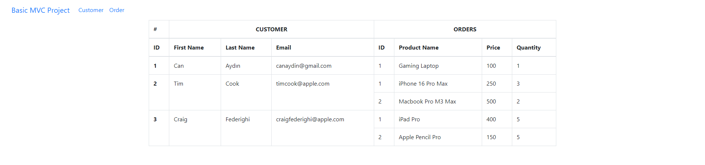

# Basic MVC Projesi

Bu proje, müşteri bilgilerini ve ilgili siparişleri görüntülemek için basit bir **ASP.NET MVC** uygulamasıdır. Proje, **Model-View-Controller (MVC)** desenini kullanarak ASP.NET MVC'de müşteriler ve siparişlerin nasıl yönetileceğini ve görüntüleneceğini göstermek amacıyla hazırlanmıştır.

## Kullanılan Teknolojiler

- **ASP.NET Core MVC** ile backend geliştirme
- **C#** programlama dili
- **Bootstrap** ile responsive tasarım ve stil
- **HTML/CSS** ile sayfa yapısı ve düzeni

## Özellikler

- Müşteri ve siparişlerin listelenmesi.
- **Müşteri Detayları**: Müşterinin adı, soyadı ve e-posta gibi bilgileri listeler.
- **Siparişler**: Her müşteri için ürün adı, fiyat ve miktar bilgilerini tablo formatında gösterir.
- Her müşteri birden fazla siparişe sahip olabilir ve bu siparişler dinamik olarak gösterilir.

### Örnek Müşteriler ve Siparişler:

## Proje Yapısı
BasicMVCProject/ 
│  
├── Controllers/  
│   └── CustomerOrdersController.cs     # Müşteri ve siparişlerin yönetimi için controller
│  
├── Models/
│   ├── Customer.cs                    # Müşteri modeli
│   └── Order.cs                       # Sipariş modeli
│
├── ViewModels/
│   └── CustomerOrderViewModel.cs      # Müşteri ve siparişleri birleştiren ViewModel
│
├── Views/
│   ├── CustomerOrders/
│   │   └── Index.cshtml               # Müşteri ve sipariş verilerini gösteren view
│
├── wwwroot/
│   ├── css/                           # CSS dosyaları
│   └── js/                            # JavaScript dosyaları
│
└── Program.cs                         # Uygulamanın başlangıç noktası
