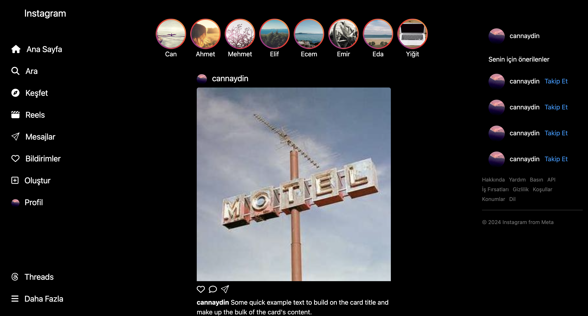

# 📸 Instagram Clone Web Sayfası

Bu proje, HTML, CSS ve Bootstrap kullanılarak oluşturulmuş bir **Instagram clone web sayfasıdır**. Sayfa, sol menü, hikaye bölümü ve gönderi kartları gibi Instagram'ın temel özelliklerini içerir.

## 🚀 Proje Özellikleri

- **Responsive Tasarım**: Mobil ve masaüstü cihazlarla uyumlu.
- **Sol Navbar**: Ana sayfa, keşfet, mesajlar gibi temel navigasyon bağlantıları.
- **Hikaye Alanı**: Kullanıcıların hikayelerini görüntülemek için.
- **Gönderi Kartları**: Kullanıcı gönderilerini gösterir (resim, açıklama, beğeni ve yorumlar).
- **Bootstrap 5 ve FontAwesome**: UI tasarımında modern bir görünüm için kullanıldı.

## 🛠️ Kullanılan Teknolojiler

- **HTML5**: Yapılandırma ve içerik düzenlemesi için.
- **CSS3**: Görsel tasarım ve stiller için.
- **Bootstrap 5**: Hızlı ve duyarlı bir yapı için.
- **FontAwesome ve Bootstrap Icons**: İkonlar için.

## 📷 Ekran Görüntüsü



## 📂 Proje Yapısı

```plaintext
📦 Proje
├── index.html        # Ana HTML dosyası
├── /img              # Resimler ve diğer medya dosyaları
└── README.md         # Proje açıklamaları
```
