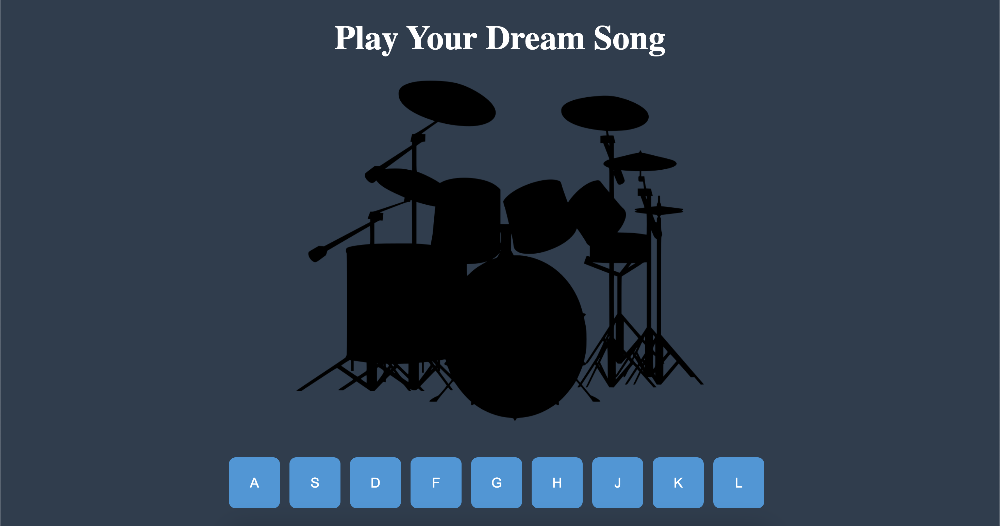

# 🥁 **Drum Kit Project**

Welcome to the **Drum Kit Project**!  
This interactive web application allows users to play drum sounds using either on-screen buttons or keyboard keys. Each button is linked to a unique drum sound, giving users a fun and engaging musical experience.  

---

## 🚀 **Features**
- 🎹 **Keyboard Support**: Press keys **A, S, D, F, G, H, J, K, L** on your keyboard to play corresponding drum sounds.  
- 🖱️ **Clickable Buttons**: Click the on-screen buttons to play sounds.  
- 🎶 **Sound Effects**: High-quality drum sounds, such as kick, snare, tom, and cymbals.  
- 💻 **Responsive Design**: The layout adapts to different screen sizes for better user experience.  

---

## 💻 **Technologies Used**
- **HTML5**: Structure of the web page  
- **CSS3**: Styling for buttons, layout, and responsive design  
- **JavaScript (ES6)**: Handles sound effects, button clicks, and keyboard events  


## 📂 **Project Structure**
```
DrumKitProject/
├── css/
│   └── style.css       # Styling for the buttons, background, and layout
├── img/
│   └── drum.png        # Drum image used in the UI
├── audio/
│   ├── boom.wav        # Sound file for “A” button
│   ├── clap.wav        # Sound file for “S” button
│   ├── hihat.wav       # Sound file for “D” button
│   ├── kick.wav        # Sound file for “F” button
│   ├── openhat.wav     # Sound file for “G” button
│   ├── ride.wav        # Sound file for “H” button
│   ├── snare.wav       # Sound file for “J” button
│   ├── tink.wav        # Sound file for “K” button
│   └── tom.wav         # Sound file for “L” button
├── js/
│   └── drumKit.js      # Main logic for playing sounds and handling user input
├── index.html          # Main HTML file for the Drum Kit interface
└── README.md           # This file describing the project
```
---

### Live
[Drum Kit](https://cannaydinn.github.io/Full-Stack_WebDevelopment)


