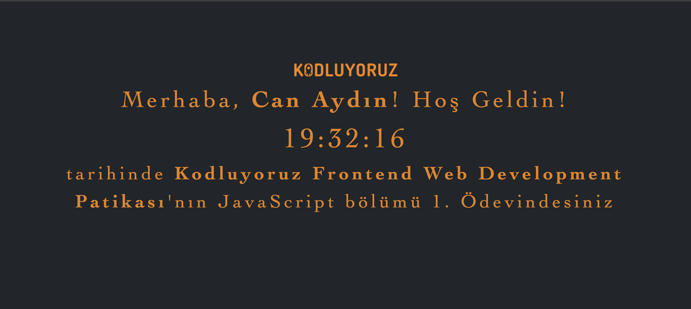

# 📅 **JavaScript Saat ve Karşılama Uygulaması**

Bu proje, kullanıcıdan adını alarak bir karşılama mesajı gösteren ve anlık saat bilgisini ekrana yansıtan basit bir **JavaScript uygulamasıdır**. Kullanıcıya hoş bir deneyim sunarken temel JavaScript kavramlarını (DOM Manipülasyonu, Date, setInterval vb.) öğretmeyi amaçlamaktadır.  

---

## 🚀 **Proje Özellikleri**
- Kullanıcıdan **prompt()** ile isim alınır.
- Kullanıcının adı, **"Merhaba, [İsim]!"** şeklinde ekranda gösterilir.
- Ekranda sürekli güncellenen bir **saat (HH:MM:SS)** gösterilir.
- Kullanıcı isim girmezse **"Herhangi bir isim girmediniz."** uyarısı verilir.

---

## 📸 **Ekran Görüntüsü**
Aşağıdaki ekran, projenin nasıl göründüğüne dair bir örnektir:  
  

---

## 📚 **Kullanılan Teknolojiler**
- **HTML5**: Yapısal içerik oluşturma  
- **CSS3**: Sayfa stil tasarımı  
- **JavaScript**: Dinamik içerik ve etkileşimli kullanıcı deneyimi  
- **Bootstrap 5**: Sayfa tasarımında hazır CSS stilleri ve sınıfları  

---

## 📂 **Proje Yapısı**
```
📦 ProjeKlasoru
├── 📁 css
│   └── style.css           // CSS tasarım dosyası
├── 📁 js
│   └── clock.js            // Saat fonksiyonları burada
├── 📜 index.html           // Ana HTML dosyası
└── 📜 README.md            // Projenin tanıtımı ve açıklamaları
```
