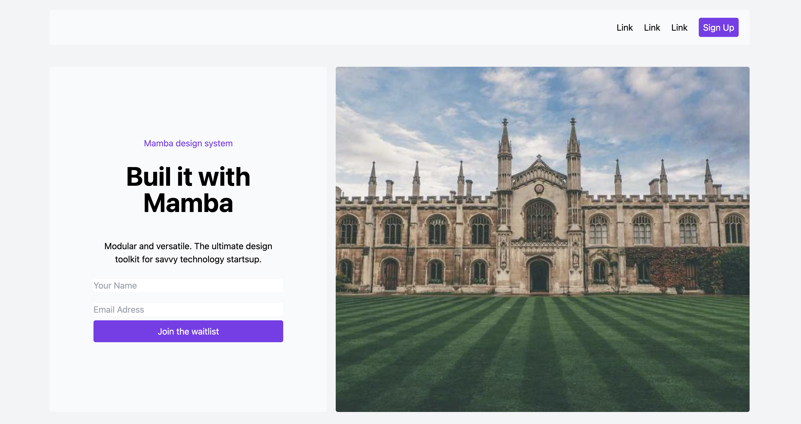

# 🖥️ Mamba Landing Page

Welcome to the **Mamba Landing Page** project! This is a modern, responsive landing page built using **HTML5**, **CSS3**, and **Tailwind CSS**. The design focuses on a clean, simple, and user-friendly experience with fully responsive layouts that look great on all devices. 

## 📸 Preview

---

## 🚀 Features

- **Responsive Design**: Works on desktops, tablets, and mobile devices.  
- **Easy Navigation**: Intuitive links and call-to-action buttons for better user interaction.  
- **Modern Layout**: Clean design using Tailwind CSS classes for fast, efficient development.  
- **Custom Forms**: Simple signup form to join the waitlist.  
- **Dynamic Sections**: Multiple content blocks to highlight features, testimonials, and company goals.  
- **Footer with Social Links**: Quick access to GitHub, Twitter, and Email.  

---

## 📂 Project Structure
'''
project-root/
│
├── 📁 images/             # Image assets for the project
├── 📄 index.html          # Main HTML file for the landing page
├── 📄 output.css          # Compiled Tailwind CSS file
└── 📄 README.md           # Documentation file (you are reading it)
'''
---

## 📦 Technologies Used

- **HTML5**: Semantic markup for better SEO and structure.  
- **CSS3**: Used for styling elements like buttons, fonts, and layout.  
- **Tailwind CSS**: Utility-first CSS framework to build fast and efficient layouts.  
- **Font Awesome**: Icon library for social media and contact icons.  

---

## 📚 Sections Included

1. **Navigation**: Clean top navigation with call-to-action buttons (Sign Up).  
2. **Hero Section**: Catchy headline, short description, and a form for collecting user info.  
3. **How It Works**: Step-by-step guide on how to use the product.  
4. **Testimonials**: Customer feedback section to build trust.  
5. **Call to Action**: Motivating users to join the community.  
6. **Footer**: Links to social media accounts and copyright information.  
