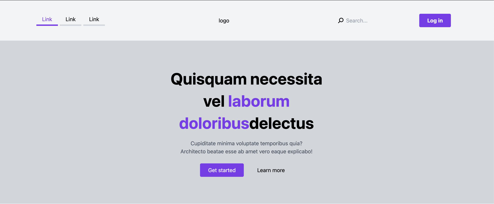
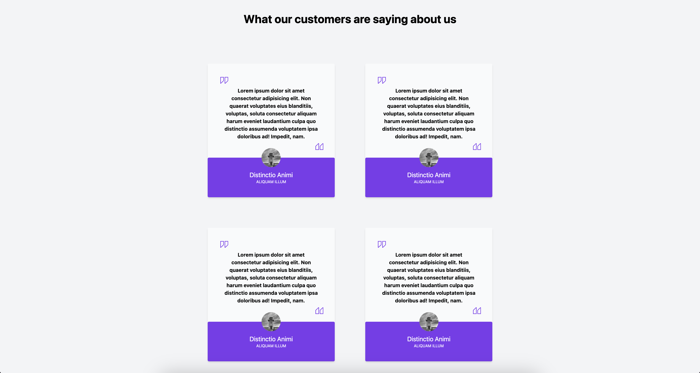
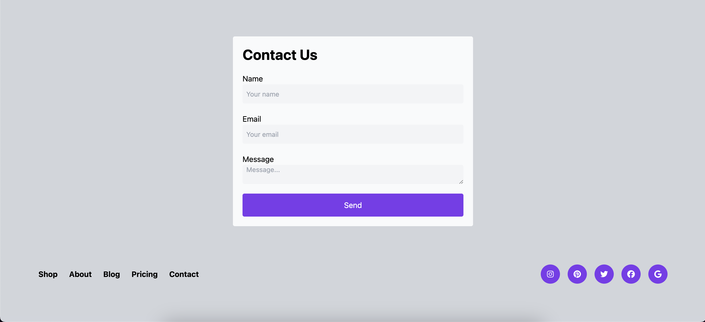

# Review Page Project

This repository contains the code for a dynamic and responsive review page, designed to display customer testimonials and reviews. The page is built using HTML and CSS, with Tailwind CSS for modern and efficient styling. It features a well-structured layout with interactive components, making it user-friendly and aesthetically pleasing.

## 📸 Preview






## Features

- **Responsive Layout**: The page adapts to different screen sizes, ensuring an optimal experience on both desktop and mobile devices.
- **Navigation Bar**: Includes a clean and animated navigation bar that offers smooth transitions and an intuitive user interface.
- **Search Functionality**: A functional search bar with a magnifying glass icon, enabling users to easily search through available content.
- **Login Button**: Prominent login button with hover effects, allowing easy access to user authentication features.
- **Customer Testimonials**: A visually appealing section showcasing customer reviews in individual cards, each containing images, names, and text content. Navigation arrows are included for better browsing through reviews.
- **Tailwind CSS**: Utilizes Tailwind CSS for fast and efficient styling, ensuring a modern, clean, and highly customizable design.


## 📂 Project Structure
```plaintext
project-root/
│
├── 📁 /assets/img/        # Image assets for the project
├── 📄 index.html          # Main HTML file for the landing page
├── 📄 output.css          # Compiled Tailwind CSS file
└── 📄 README.md           # Documentation file
```


## Technologies Used

-- **HTML5**: The structure of the web page.
-- **CSS3**: For basic styling.
-- **Tailwind CSS**: For responsive, utility-first design.
-- **JavaScript (Optional)**: For enhanced interactivity, such as the search bar (if applicable).
